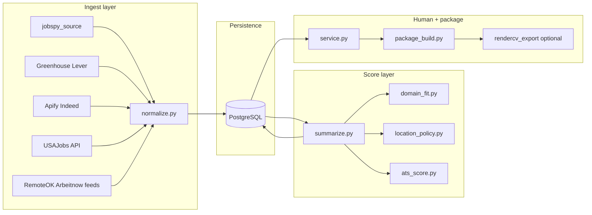

# System design and roadmap

This document complements [README.md](README.md): it spells out **how** major subsystems are intended to behave, **where** hooks live in code, and **how** phased enhancements fit together.

---

## Configuration: `job_pipeline_config.json`

The loader in [job_pipeline/ingest.py](job_pipeline/ingest.py) merges legacy keys with nested `sources.*`:

- **`sources.greenhouse`** — `enabled`, `board_tokens`
- **`sources.lever`** — `enabled`, `companies`, `max_postings`
- **`sources.indeed`** — `enabled`, `apify` actor settings (unchanged)
- **`sources.jobspy`** — optional: `enabled`, `site_names`, `search_term`, `google_search_term`, `location`, `results_wanted`, `hours_old`, `country_indeed`
- **`sources.usajobs`** — optional: `enabled`, `keyword`, `location_name`, `results_per_page`
- **`sources.feeds`** — optional: `{ "remoteok": { "enabled", "slug_or_query" }, "arbeitnow": { "enabled", "limit" } }`
- **`filters`** — extended with:
  - **`min_salary_usd`** (existing; used by salary gate)
  - **`location_policy`** — optional block (see below)
- **`matching`** — auto-close thresholds, `salary_hard_gate`, `explain_scores` (existing)

Matching thresholds remain via `matching_thresholds()` in [job_pipeline/ingest.py](job_pipeline/ingest.py); location policy uses the same merged config dict.

---

## Location policy (`filters.location_policy`)

Implemented in [job_pipeline/location_policy.py](job_pipeline/location_policy.py).

**Intent:**

- Prefer **remote** and **national remote** postings.
- Allow **hybrid** or **onsite** when the location string or description mentions the configured **metro keywords** (e.g. Philadelphia / PA).
- Optionally **reject** onsite/hybrid-only roles that neither mention metro keywords nor obviously remote-friendly language.
- If **`require_tech_role_for_onsite`** is true, onsite/hybrid outside allowed patterns only passes when [domain_fit.py](job_pipeline/domain_fit.py) detects at least one **technology-aligned** role family hit (not pure logistics/coordination).

**Outputs:**

- **`action`** — `accept` \| `reject` \| `neutral`
- **`multiplier`** — applied to blended fit when `neutral`/`accept` soft-tunes ranking
- **`reason_code`** — stored in summary JSON for auditing

Rejected rows are auto-closed in `summarize_pipeline_item`, similar to junk or low combined score.

---

## Scoring pipeline (`summarize.py`)

Stages (conceptual):

1. **LLM JSON triage** — headline, verdict, gaps, **`seniority_fit`**, `fit_score_0_1`, junk flags (unchanged payload shape except extra stored fields downstream).
2. **Heuristic fit** — skill substring hits vs resume metadata in `application_assets.json`.
3. **ATS overlap** — [job_pipeline/ats_score.py](job_pipeline/ats_score.py): Jaccard token overlap (+ optional enrichment) between posting text and a **canonical resume text** bundle built from resume metadata and optional plaintext extraction from referenced PDF paths.
4. **Base blended** — `0.52 * llm_fit + 0.33 * heuristic_fit + 0.15 * ats_fit` when ATS runs; fallback omits ATS term and uses legacy `0.58 * llm + 0.42 * heuristic`.
5. **Seniority multiplier** — from `seniority_fit` plus title tokens (Junior/Entry vs Senior/Principal/Lead for IC). Tech-heavy avoidance of senior titles per career profile knobs.
6. **Deterministic LLM caps** — if extracted JD **`min_years_experience`** from regex exceeds **`profile.constraints.max_apply_min_years_experience_gap`** tolerance vs `profile.constraints.claim_years_technical_experience`, the model fit term is capped before blending.
7. **Domain multiplier** — [job_pipeline/domain_fit.py](job_pipeline/domain_fit.py) `merge_blended_with_domain`.
8. **Location multiplier or hard reject** — location policy applied after domain blend to `combined`; reject closes row.
9. **Search preferences** — deterministic rules from [`job_pipeline/search_preferences.md`](job_pipeline/search_preferences.md) via [`job_pipeline/search_preferences.py`](job_pipeline/search_preferences.py): work-mode and proximity boosts with a clamped `pref_multiplier`, plus optional hard close reasons `search_preferences:*` when enabled in `job_pipeline_config.json`.
10. **List rank** — existing verdict multiplier + junk collapse.
11. **Auto-close** — salary gate + low combined + pass verdict thresholds (unchanged structure).

Structured audit fields appended to **`summary_json`**: `location_policy`, `search_preferences`, `seniority_mult`, `ats_score`, `ats_notes`, deterministic cap notes.

---

## Career profile (`job_pipeline/career_profile.json`)

[job_pipeline/domain_fit.py](job_pipeline/domain_fit.py) consumes:

- **`identity`** — `primary_domain`, `secondary_domain`, `tech_as_primary`, `tech_as_support`, `management_track`, **`experience_band`** (e.g. `junior`).
- **`target_role_families`**, **`avoid_role_families`** — control family intersections.
- **`target_titles`**, **`avoid_titles`** — title phrase boosts and hard avoids.
- **`identity_prompt`** — short bullet list rendered into summarize system context (replaces stale hardcoded ops-first narrative).
- **`constraints`** — optional integers for ATS/YOE governance.

**Families** include IT support, helpdesk, NOC, junior systems, technical operations — see `FAMILY_KEYWORDS` in domain_fit.py.

---

## Ingest source taxonomy

| Class | Sources | Stability |
|---------|---------|-----------|
| First-party ATS JSON | Greenhouse, Lever | High |
| Paid / batch scraper | Apify Indeed | High (paid dependency) |
| Aggregator library | JobSpy boards | Medium (sites change HTML randomly) |
| Federal API | USAJobs | High (needs API registration + keys) |
| Public JSON endpoints | RemoteOK job API, Arbeitnow API | Medium |

OSS reference list and license notes remain in [GITHUB_REPOS_TO_BORROW.md](GITHUB_REPOS_TO_BORROW.md). **Important:** AGPL projects (for example ApplyPilot) are inspiration-only — avoid pasting AGPL code into MIT personal tooling.

---

## State machine alignment

Statuses are defined canonically in [job_pipeline/states.py](job_pipeline/states.py) and mirrored in Postgres via [job_pipeline/schema.sql](job_pipeline/schema.sql):

`ingested` → summarized (`ranked` briefly) → `pending_review` → `drafted` | `approved` → `package_ready` → `submitted` → `rejected` | `responded` | ...

**Terminal:** `closed` covers auto-filter, skip-without-submit.

[IMAP rejection sync](job_pipeline/inbox_sync.py) transitions **`submitted`** → **`rejected`** when inbound mail matches deterministic patterns and fuzzy company/title match against queued submissions.

---

## Package build: RenderCV path

Canonical markdown export remains in [job_pipeline/resume_export.py](job_pipeline/resume_export.py). Optional **YAML → PDF** RenderCV invocation lives in [job_pipeline/rendercv_export.py](job_pipeline/rendercv_export.py), triggered during `svc_build_package` when `JOB_PIPELINE_RENDERCV_RENDER=1` (or `--` config default). Output path is embedded in **`package_meta.rendercv_pdf`**.

Dependencies and platform install for LaTeX/RenderCV are left to upstream RenderCV documentation.

---

## Browser automation (gated last)

[`job_pipeline/auto_apply/browser_agent.py`](job_pipeline/auto_apply/browser_agent.py) exposes a guarded wrapper around **`browser-use`**. Intended usage:

- **Never** unconditional bulk submit.
- Default **dry_run** attaches intent + warning if dependency missing or budget exceeded.
- Envs: **`BROWSER_USE_MAX_RUNS_PER_DAY`**, **`BROWSER_USE_JOB_APPLY_PROMPT`** (partial override).

You are solely responsible for site ToS compliance and credential safety.

---

## Phase rollout (implemented map)

Documentation + config shape first, then ingestion breadth, scoring refinements, package exports, integrations:

1. **Docs** — README + this blueprint.
2. **Phase A** — Tech-primary career profiles + richer families + driven identity prompt strings.
3. **Phase B** — Location policy + config.
4. **Phase C** — Seniority + deterministic LLM/YOE caps.
5. **Phase D** — JobSpy + USAJobs + RemoteOK/Arbeitnow feeds.
6. **Phase E** — ATS heuristic overlap persisted in summaries.
7. **Phase F** — RenderCV export hook in package path.
8. **Phase G** — IMAP rejection sync (+ service / API wrappers).
9. **Phase H** — browser-use scaffolding + daily budget.

---

## Operational caveats

- **LinkedIn / HTML scrapers**: expect periodic breakages — keep multiple boards live.
- **LLM-heavy browser agents**: can run **high token spend** — route only after approval and budgets.
- **ATS overlap score** here is heuristic, not Vendor-grade Greenhouse calibration — tune weights after live feedback.
- **`.env`** holds secrets — never commit; prefer service accounts for Gmail IMAP (`app password` flows).

---

## Acceptance checks

- Ingest emits rows with sane `normalize_apply_url` dedupe collisions.
- New postings respect **salary_floor**, **location_policy**, **seniority_mult** without blindly killing legitimate remote Tier-2 IT support roles.
- `summary_json.location_policy` readable for debugging auto-closes.

This file should be kept in sync whenever scoring constants or ingest source keys change materially.
